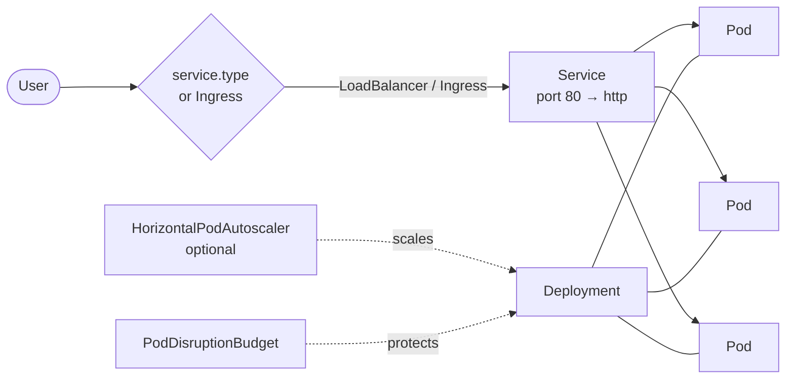

# Helm Chart: helloapp


A reusable **Helm chart** that deploys Google's sample web server [`hello-app`](https://github.com/GoogleCloudPlatform/kubernetes-engine-samples/tree/main/quickstarts/hello-app) to any Kubernetes cluster (GKE, EKS, AKS, minikube, kind).

The same chart can be installed as a small dev setup or as a production-style setup with autoscaling and an Ingress, just by changing a values file. Every change is linted, validated and installed on a test cluster by GitHub Actions.

## Architecture



## Chart contents

| Template | Created when | Purpose |
|---|---|---|
| `deployment.yaml` | always | Runs the app with probes, resources and security settings |
| `service.yaml` | always | Exposes the pods (`LoadBalancer`, `ClusterIP` or `NodePort`) |
| `pdb.yaml` | `podDisruptionBudget.enabled` | Keeps pods running during node maintenance |
| `hpa.yaml` | `autoscaling.enabled` | Scales pods on CPU usage |
| `ingress.yaml` | `ingress.enabled` | Routes a host name (and TLS) to the Service |
| `tests/test-connection.yaml` | `helm test` | Checks the app answers `Hello, world!` |
| `NOTES.txt` | after install | Prints how to reach the app |
| `values.schema.json` | always | Rejects invalid values, e.g. a typo in `service.type` |

## Quick start

```bash
git clone https://github.com/demanou/helmchart-template-deployment.git
cd helmchart-template-deployment

# Install with the default values (3 replicas behind a LoadBalancer)
helm install helloapp ./charts/helloapp

# Check that it works
helm test helloapp

# Get the external IP
kubectl get svc helloapp -w
```

Open `http://<EXTERNAL-IP>`. The page shows `Hello, world!`, the version, and the name of the pod that answered.

### Other setups

```bash
# Local cluster (minikube / kind): 1 replica, ClusterIP
helm install helloapp ./charts/helloapp -f examples/values-dev.yaml
kubectl port-forward svc/helloapp 8080:80   # then open http://localhost:8080

# Production style: autoscaling 3–10 pods, NGINX Ingress with TLS
helm install helloapp ./charts/helloapp -f examples/values-prod.yaml
```

### Day-2 operations

```bash
# Preview the generated Kubernetes YAML without installing
helm template helloapp ./charts/helloapp

# Change a setting
helm upgrade helloapp ./charts/helloapp --set replicaCount=5

# Deploy a new version of the app
helm upgrade helloapp ./charts/helloapp --set image.tag=2.0

# History and rollback
helm history helloapp
helm rollback helloapp 1

# Remove everything
helm uninstall helloapp
```

## Configuration

| Value | Default | Description |
|---|---|---|
| `replicaCount` | `3` | Number of pods (ignored when autoscaling is on) |
| `image.repository` | `us-docker.pkg.dev/google-samples/containers/gke/hello-app` | Container image |
| `image.tag` | `""` (uses `appVersion` = `1.0`) | Image version |
| `containerPort` | `8080` | Port the app listens on |
| `service.type` | `LoadBalancer` | `ClusterIP`, `NodePort` or `LoadBalancer` |
| `service.port` | `80` | Service port |
| `ingress.enabled` | `false` | Create an Ingress |
| `autoscaling.enabled` | `false` | Create an HPA (`minReplicas`, `maxReplicas`, `targetCPUUtilizationPercentage`) |
| `podDisruptionBudget.enabled` | `true` | Create a PDB with `minAvailable: 1` |
| `resources` | 25m CPU / 32–64Mi | Requests and limits |
| `readinessProbe` / `livenessProbe` | HTTP `GET /` | Health checks |
| `podSecurityContext` / `securityContext` | non-root, read-only | Security settings |

See [`charts/helloapp/values.yaml`](charts/helloapp/values.yaml) for all options.

## Best practices built in

- **Standard labels and names:** `app.kubernetes.io/*` labels and the `<release>-<chart>` naming from `helm create`, so several releases can live in the same namespace.
- **Zero-downtime updates:** rolling updates with `maxUnavailable: 0`, readiness probes and a PodDisruptionBudget.
- **Security by default:** non-root user, read-only filesystem, all Linux capabilities dropped and no service account token. It passes the Kubernetes **restricted** Pod Security Standard.
- **Validated input:** `values.schema.json` makes Helm refuse invalid values before anything is deployed.
- **Built-in test:** `helm test` checks the deployed app really answers.

## Continuous integration

On every push, GitHub Actions:

1. Runs `helm lint --strict` and validates the rendered YAML against the Kubernetes schemas (`kubeconform`) for the default, dev and prod values.
2. Installs the chart on a temporary [kind](https://kind.sigs.k8s.io/) cluster, runs `helm test`, then performs a rolling upgrade.

## Project structure

```
.
├── charts/helloapp/
│   ├── Chart.yaml
│   ├── values.yaml
│   ├── values.schema.json
│   └── templates/
│       ├── _helpers.tpl        # Shared names and labels
│       ├── deployment.yaml
│       ├── service.yaml
│       ├── hpa.yaml
│       ├── ingress.yaml
│       ├── pdb.yaml
│       ├── NOTES.txt
│       └── tests/test-connection.yaml
├── examples/
│   ├── values-dev.yaml
│   └── values-prod.yaml
└── .github/workflows/ci.yml
```

## Skills demonstrated

Helm · Kubernetes · Go templating · Deployments, Services, Ingress · Horizontal Pod Autoscaling · Pod Security Standards · JSON Schema · GitHub Actions · kind
